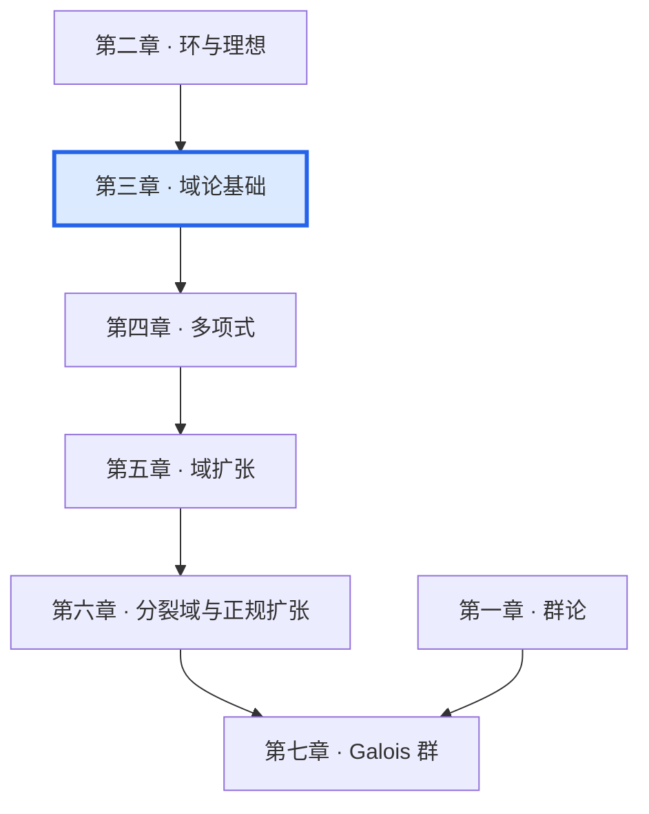

# 第三章 · 域论基础

  基础理论
  依赖：[第一章 · 群论](/chapters/01-groups/) · [第二章 · 环与理想](/chapters/02-rings/)

## 概述

域是代数结构中最接近我们直觉的"数系"概念。有理数 $\mathbb{Q}$、实数 $\mathbb{R}$、复数 $\mathbb{C}$ 都是域的例子，但域论的真正力量在于它为**多项式方程的可解性**提供了精确的语言。

本章建立域论的基本词汇：
- **域的定义**：具有乘法逆元的交换环
- **域的特征**：素数或零，决定了域的"算术基底"
- **域扩张**：将域嵌入更大的域，是 Galois 理论的核心操作
- **代数元与超越元**：扩张中元素的分类
- **极小多项式**：代数元的"代数身份证"

## 章节导航

| 节次 | 主题 | 关键概念 |
|------|------|----------|
| §3.1 | [域的定义与基本性质](3.1-basic-definitions) | 域、除环、域的特征、素域 |
| §3.2 | [域的基本扩张](3.2-basic-extensions) | 域扩张、扩张次数、塔定律 |
| §3.3 | [代数元与极小多项式](3.3-algebraic-elements) | 代数元、超越元、极小多项式、代数扩张 |

## 本章的关键洞察

::: details 💡 为什么域论是 Galois 理论的基础？
Galois 理论的核心问题是：**多项式方程何时可用根式求解？** 这个问题需要精确地讨论：
1. **根在哪个域中？** → 需要域扩张理论
2. **根的对称性是什么？** → 需要 Galois 群（自同构群）
3. **如何从对称性推断可解性？** → 需要 Galois 对应

域论为我们提供了讨论这些问题的语言。
:::

## 与其他章节的联系

---

  ← [第二章 · 环与理想](/chapters/02-rings/)
  [§3.1 域的定义与基本性质 →](3.1-basic-definitions)

